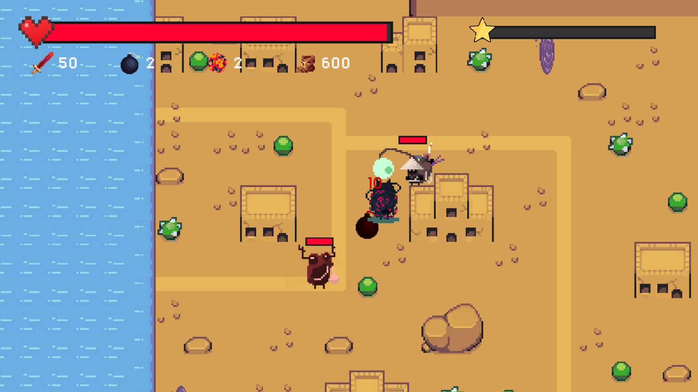
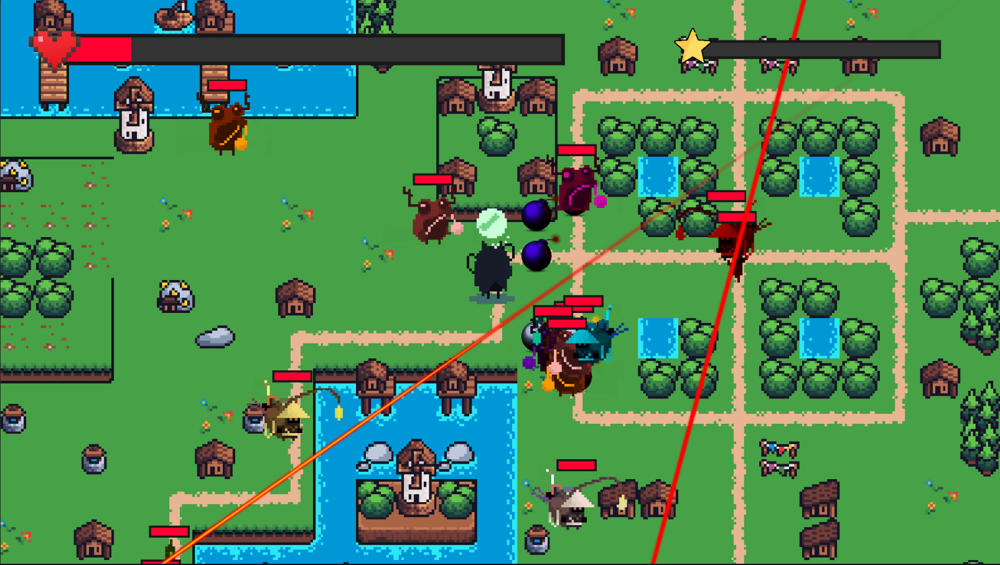
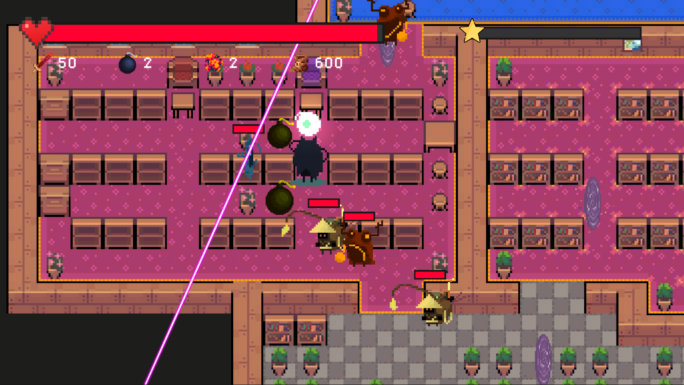
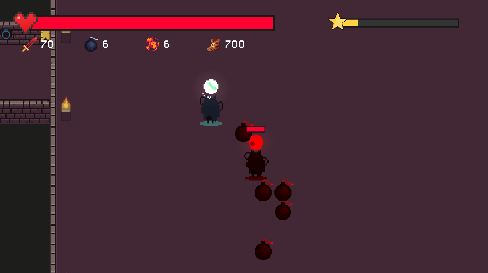
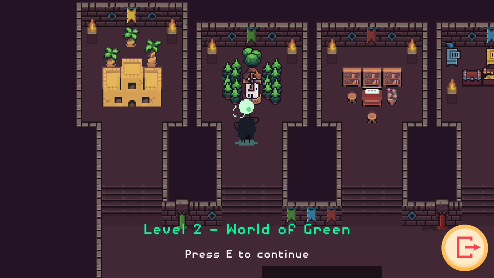
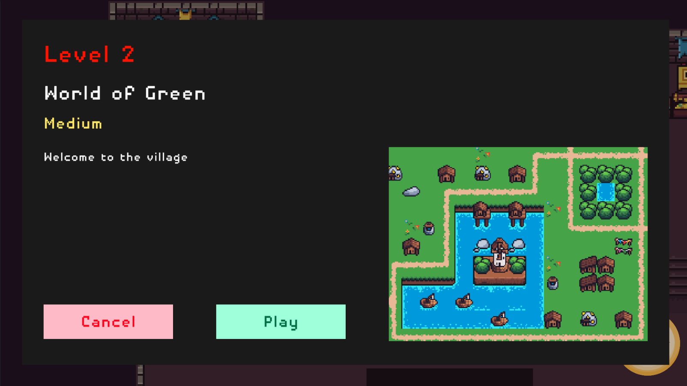

# Boom Master

Blow up all the enemies in the way and save the world!

## Description

Bomb Master is a single-player 2D top-down action game where the player will place bombs to clear all enemies. The game is inspired from the first "bomb" game, Super Bomberman.

There are 4 levels in this game, ramping up in difficulty, where the last one is boss battle.

## Platform

Desktop

## Unity version

2020.2.1f1

## Contributors

- Khai Truong - [khaitruong922](https://github.com/khaitruong922) - Game Developer & Game Designer

- Thong Thanh Vo - [vothanhthong](https://github.com/vothanhthong) - Game Designer

## Preview

||
|:--:| 
| *Level 1* |

||
|:--:| 
| *Level 2* |

||
|:--:| 
| *Level 3* |

||
|:--:| 
| *Level 4* |

||
|:--:| 
| *Lobby* |

||
|:--:| 
| *Map Selection* |

## How to play?

Hold WASD keys to move your character.

Press Space key to place bomb.

Clear all the enemies in the map to win.

## Where to play?

Play the game [here](https://khaitruong922.itch.io/boom-master)

## Acknowledgement

### Art

- [Lunar Battle Pack](https://mattwalkden.itch.io/lunar-battle-pack)

- [RPG Nature Tileset - Seasons](https://stealthix.itch.io/rpg-nature-tileset)

- [Field of Green](https://guttykreum.itch.io/field-of-green)

- [Lanitse assets : flames pack 1 (v0.1)](https://jiraton.itch.io/erana-iasana-assets-fxes-gunfire)

- [Sci-Fi Character Pack](https://penusbmic.itch.io/)

- [Indoor Tileset](https://tilation.itch.io/16x16-small-indoor-tileset)

- [2D Pixel Art Portal Sprites](https://elthen.itch.io/2d-pixel-art-portal-sprites)

- [Dungeon Tileset](https://0x72.itch.io/16x16-dungeon-tileset)

- [PixelHole's Overworld Tileset](https://pixelhole.itch.io/pixelholes-overworld-tileset)

- [Bomb Sprite](https://steemit.com/pixelart/@loomy/pixel-art-items-i-am-using-in-my-current-project)

- [Magical Items & Potions tileset](https://wilfryed.itch.io/magical-potions-items-tileset)

- [16x16 RPG Icons - Pack 1 - Free Sample](https://www.deviantart.com/7soul1/art/16x16-RPG-Icons-Pack-1-Free-Sample-467188465)

### Fonts

- [1001 Fonts - Pixel Fonts](https://www.1001fonts.com/pixel-fonts.html)

### Audio

- [Free Sound Effects - Mixkit](https://mixkit.co/free-sound-effects/)

- [Wingless Seraph - Professional Game Music for FREE](https://wingless-seraph.net/en/index.html)
